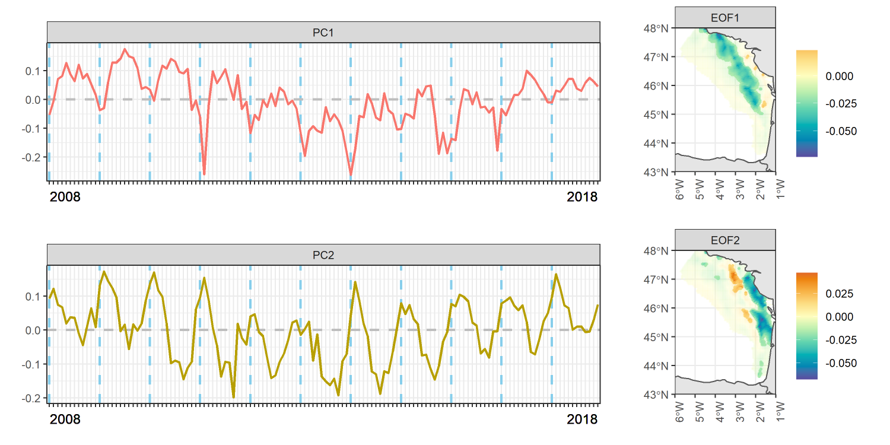
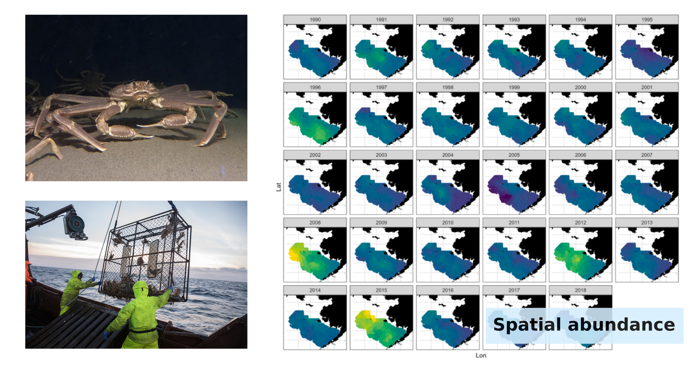

#### Species distribution, spatial ecology and spatio-temporal statistics

{width="100%"}

Some references:

- Michel M., Alglave B., Olmos M., Torterotot M., Virgili A., Martin-Marin S., Royer J.Y., Samaran F. (2025). Modelling the influence of environmental factors on the acoustic presence of blue whale populations in the Southern Indian Ocean. Scientific Reports (Nature). <a href="https://doi.org/10.1038/s41598-025-02941-9">link</a>

- Alglave B., Mourguiart B., Vermard Y., Rivot E., Woillez M., Kristensen K., Etienne M.P. (2025). Change of support for zero-inflated data: deriving fine scale species distribution inferences from spatially aggregated data. Journal of the Royal Statistical Society Series C: Applied Statistics. <a href="https://doi.org/10.1093/jrsssc/qlaf056">link</a> 

<!-- - Alglave B., Olmos, M., Casemajor, J., Etienne, M. P., Rivot, E., Woillez, M., Vermard, Y. (2024). Investigating fish reproduction phenology and essential habitats by identifying the main spatio-seasonal patterns of fish distribution. ICES Journal of Marine Science. <a href="https://doi.org/10.1093/icesjms/fsae099">link</a> -->

<!-- - Alglave B., Vermard Y., Rivot E., Etienne M.P., Woillez M. (2023). Identifying mature fish aggregation areas during spawning season by combining catch declarations and scientific survey data. Canadian Journal of Fisheries and Aquatic Sciences. <a href="http://dx.doi.org/10.1139/cjfas-2022-0110">link</a> -->

- Alglave B., Rivot E., Etienne M.P., Woillez M., Thorson J.T., Vermard Y. (2022). Combining scientific survey and commercial catch data to map fish distribution.ICES Journal of Marine Science. <a href="https://doi.org/10.1093/icesjms/fsac032">link</a>

#### Population dynamics, climate change and mechanistico-statistical modeling

{width="100%"}

Some references:

- Szuwalski C., Alglave B., Balstad L.J., Olmos M., Punt A.E., Richar J., Stockhausen W., and Veron M. (2026). Density dependence modulates climate change impacts on eastern Bering Sea snow crab. Journal of Applied Ecology. <a href="https://doi.org/10.1111/1365-2664.70316">link</a>

- Rovellini A., Punt A.E., Bryan M.D., Kaplan I.C., Dorn M.W., Aydin K., Fulton E.A., Alglave B., Baker M.R., Carroll G., Ferriss B.E., Haltuch M.A., Hayes A.L., Hermann A.J., Hernvann P.Y., Holsman K.K., Liu O.R., McHuron E., Morzaria-Luna H.N., Moss J., Surma S., Weise M.T. (2024). Linking climate stressors to ecological processes in ecosystem models, with a case study from the Gulf of Alaska. ICES Journal of Marine Science. <a href="https://doi.org/10.1093/icesjms/fsae002">link</a>

- Olmos M., Cao J., Thorson J.T., Punt A.E., Monnahan C.C., Alglave B., Szuwalski C. (2023). A step towards the integration of spatial dynamics in population dynamics models: Eastern Bering Sea snow crab as a case study. Ecological Modelling. <a href="https://doi.org/10.1016/j.ecolmodel.2023.110484">link</a>
